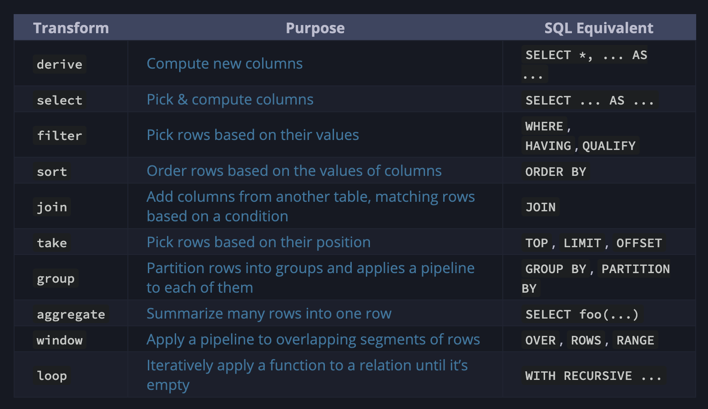

# Notes

- [Notes](#notes)
  - [Introduction](#introduction)
  - [Relations](#relations)
    - [select](#select)
    - [derive](#derive)
    - [join](#join)
    - [join+select+derive](#joinselectderive)
  - [Filtering](#filtering)
    - [filter](#filter)
    - [take](#take)
    - [take+filter](#takefilter)
  - [Aggregation](#aggregation)
    - [aggregate](#aggregate)
    - [group](#group)
  - [operators](#operators)
    - [case](#case)
    - [ranges (inclusive)](#ranges-inclusive)
  - [Variables - let\&into](#variables---letinto)
  - [Functions](#functions)
  - [Transforms](#transforms)

## Introduction

```sql
from tracks
filter artist == "Bob Marley"  # Each line transforms the previous result
aggregate {                    # `aggregate` reduces each column to a value
  plays    = sum plays,
  longest  = max length,
  shortest = min length,       # Trailing commas are allowed
}
```

```lua
from"tracks"
   :filter(f"artist" == "Bob Marley")
   :aggregate {
      plays    = sum{f"plays"},
      longest  = max{f"length"},
      shortest = min{f"length"},
   }
```

```sql
from employees
filter start_date > @2021-01-01            # Clear date syntax
derive {                                   # `derive` adds columns / variables
  gross_salary = salary + (tax ?? 0),      # Terse coalesce
  gross_cost = gross_salary + benefits,    # Variables can use other variables
}
filter gross_cost > 0
group {title, country} (                   # `group` runs a pipeline over each group
  aggregate {                              # `aggregate` reduces each group to a value
    average gross_salary,
    sum_gross_cost = sum gross_cost,       # `=` sets a column name
  }
)
filter sum_gross_cost > 100_000            # `filter` replaces both of SQL's `WHERE` & `HAVING`
derive id = f"{title}_{country}"           # F-strings like Python
derive country_code = s"LEFT(country, 2)"  # S-strings permit SQL as an escape hatch
sort {sum_gross_cost, -country}            # `-country` means descending order
take 1..20                                 # Range expressions (also valid as `take 20`)
```

```lua
from"employees"
   :filter(f"start_date" > "@2021-01-01")
   :derive {
      gross_salary = f"salary" + (f"tax":def(0)),
      gross_cost   = f"gross_salary" + f"benefits",
   }
   :filter (f"gross_cost" > 0)
   :group {
      {f"title", f"country"}, function(g)
        return g:aggregate {
           average{f"gross_salary"},
           sum_gross_cost = sum{f"gross_cost"},
        }
      end
   }
   :filter(f"sum_gross_cost" > 100*1000)
   :derive { id = concat{f"title", "_", f"country"} }
   :derive { country_code = left{f"country", 2} }
   :sort { f"sum_gross_cost", -f"country" } -- ??? desc?
   :take(1, 20)
```

## Relations

### select

```sql
-- The select function picks the columns to pass through based on a list and discards all others.
-- Formally, that list is a tuple of comma-separated expressions wrapped in { ... }.
from invoices
select { order_id, total } -- only realiassing available

from invoices
select {
  OrderID = invoice_id,
  Total = total,
}
```

```lua
from "invoices"
   :select{ "order_id", "total" }

from "invoices"
   :select{ -- just realiasing
      OrderID = "order_id",
      Total = "total",
   }
```

### derive

```sql
from invoices
derive { VAT = total * 0.19 }
```

```lua
from "invoices"
   :derive{
      VAT = f"total" * 0.19 -- expression (or constant)
   }
```

### join

```sql
from invoices
join customers ( ==customer_id )

from inv=invoices
join cust=customers ( ==customer_id )

from employees
join side:left positions (employees.id==positions.employee_id)

from employees
join side:left p=positions (employees.id==p.employee_id)

from tracks
join side:left artists (
  # This adds a `country` condition, as an alternative to filtering
  artists.id==tracks.artist_id && artists.country=='UK'
)
```

```lua
from "invoices"
   :join("customers", f"customer_id")

from{ inv="invoices" }
   :join({cust="customers"}, f"customer_id")

from "employees"
   :join({"positions", side="left"}, f"employees.id" == f"positions.employee_id")

from "employees"
   :join({p="positions", side="left"}, f"employees.id"==f"p.employee_id")

from "tracks"
   :join({"artists",side="left"}, f"artists.id" == f"tracks.artist_id" and f"artists.country" == "UK")
```

PRQL manipulates relations (tables) of data.
The `derive`, `select`, and `join` transforms change the number of columns in a table.
The first two never affect the number of rows in a table.
`join` may change the number of rows, depending on the chosen type of join.

### join+select+derive

```sql
from inv=invoices
join cust=customers (==customer_id)
derive { VAT = inv.total * 0.19 }
select {
  OrderID = inv.invoice_id,
  CustomerName = cust.last_name,
  Total = inv.total,
  VAT,
}
```

```lua
from {inv="invoices"}
   :join({cust="customers"}, f"customer_id")
   :derive { VAT = f"inv.total" * 0.19 }
   :select {
      OrderID = f"inv.invoice_id",
      CustomerName = f"cust.last_name",
      Total = f"inv.total",
      f"VAT"
   }
```

## Filtering

### filter

```sql
from invoices
filter billing_city == "Berlin"
```

```lua
from "invoices"
   :filter(f"billing_city" == "Berlin")
```

### take

```sql
from invoices
take 4

from invoices
take 4..7 # inclusive
```

```lua
from "invoices"
   :take(4)

from "invoices"
   :take(4, 7) -- inclusive
```

### take+filter

```sql
from invoices
filter billing_city == "Berlin" # retain only rows for orders from Berlin
take 11..20                     # skip first 10 rows and take the next 10
take 3                          # take only first 3 rows of *that* result
```

```lua
from "invoices"
   :filter(f"billing_city" == "Berlin")
   :take(11, 20)
   :take(3)
```

## Aggregation

### aggregate

```sql
from invoices
aggregate { sum_of_orders = sum total }

from invoices
aggregate {
    num_orders = count this,
    sum_of_orders = sum total,
}
```

```lua
from "invoices"
   :aggregate { sum_of_orders = sum{f"total"} }

from "invoices"
   :aggregate {
      num_orderrs = count{},
      sum_of_orders = sum{f"total"},
   }
```

### group

```sql
from invoices
group billing_city (
    aggregate {
        num_orders = count this,
        sum_of_orders = sum total,
    }
)

from invoices -- will not support yet
group billing_city (
    take 2
)
```

```lua
from "invoices"
   :group({f"billing_city"}, function(g)
     return g:aggregate {
        num_orderrs = count{},
        sum_of_orders = sum{f"total"},
     }
   end)

from "invoices"
   :group({f"billing_city"}, function(g)
      return g:take(2)
   end)
```

## operators

```sql
from foo
select {
  circumference = diameter * 3.14159,
  area = (diameter / 2) ** 2,
  color,
}
filter circumference > 10 && color != "red"
```

```lua
from "foo"
   :select{
      circumference = f"diameter" * 3.14159,
      area = (f"diameter" / 2) ^ 2,
      f"color",
   }
   :filter(f"circumference" > 10 and f"color" ~= "red")
```

Because `pipe` usually used with `in` ranges operator, let's allow `:isin` method for `f`.

```sql
from employees
derive is_proximate = (distance | in 0..20) # Requires parentheses, because it contains a pipe
derive total_distance = (sum distance) # Requires parentheses, because it's a function call
derive min_capped_distance = (min distance ?? 5) # `??` doesn't require parentheses, as it's not a function call
derive travel_time = distance / 40 # No parentheses needed, because no function call
derive distance_rounded_2_dp = (math.round 1+1 distance) # No inner parentheses needed around `1+1` because no function call
derive {
  # Requires parentheses, because it contains a pipe
  is_far = (distance | in 100..),
  # The left value of the range requires parentheses,
  # because of the minus sign
  is_negative = (distance | in (-100..0)),
  # ...this is equivalent
  is_negative = (distance | in (-100)..0),
  # _Technically_, this doesn't require parentheses, because it's
  # the RHS of an assignment in a tuple
  # (this is especially confusing)
  average_distance = average distance,
}
# Requires parentheses because of the minus sign
sort (-distance)
# A tuple is fine too
sort {-distance}
```

```lua
from "employees"
   :derive {
      is_proximate = f"distance":isin(0, 20),
   }
   :derive {
      total_distance = sum{f"distance"},
   }
   :derive {
      min_capped_distance = min{f"distance":def(5)},
   }
   :derive {
      travel_time = f "distance" / 40,
   }
   :derive {
      distance_rounded_2_dp = round{f"distance", 1+1},
   }
   :derive {
      is_far = f "distance":isin(100, +inf),
      is_negative = f "distance":isin(-100, 0),
      average_distance = average{ f "distance" }
   }
   :sort {-f"distance"}
```

### case

Search for the first condition that evaluates to true and return its associated value.
If none of the conditions match, null is returned.

```sql
from employees
derive distance = case [
  city == "Calgary" => 0,
  city == "Edmonton" => 300,
  true => "Unknown",
]
```

```lua
from "employees"
   :derive {
      distance = case {
         { f"city" == "Calgary", 0 },
         { f"city" == "Edmonton", 300 },
         { true, "Unknown" },
      },
   }
```

### ranges (inclusive)

```sql
from events
filter (created_at | in @1776-07-04..@1787-09-17)
filter (magnitude | in 50..100)
derive is_northern = (latitude | in 0..)
```

```lua
from "events"
   :filter (f"created_at" :isin("@1776-07-04", "@1787-09-17"))
   :filter (f"magnitued"  :isin(50, 100))
   :derive {
      is_northern = f "latitude":isin(0, +inf)
   }
```

```sql
from orders
sort {-value, created_at}
take 101..110
```

```lua
from "orders"
   :sort {-f"value", f"created_at"}
   :take(101, 110)
```

## Variables - let&into

```sql
let top_50 = (
  from employees
  sort salary
  take 50
  aggregate {total_salary = sum salary}
)

from top_50      # Starts a new pipeline
```

```lua
let "top_50" {
   from "employees"
      :sort { f"salary" }
      :take (50)
      :aggregate {
         total_salary = sum{f "salary"}
      }
}

from "top_50" -- new pipeline
```

```sql
from employees
take 50
into first_50

from first_50
```

```lua
from "employees"
   :take(50)
   :into "first_50"

from "first_50"
```

## Functions

```sql
let fahrenheit_to_celsius = temp -> (temp - 32) / 1.8

from cities
derive temp_c = (fahrenheit_to_celsius temp_f)
```

```lua
local fahrenheit_to_celsius = def ("temp") {
   f"temp" - 32 / 1.8;
}

from "cities"
   :derive {
      temp_c = fahrenheit_to_celsius(f"temp_f")
   }
```

This function is named interp, and has two positional parameters named high and x,
and one named parameter named low which takes a default argument of 0.
It calculates the proportion of the distance that x is between low and high.

```sql
let interp = low:0 high x -> (x - low) / (high - low)

from students
derive {
  sat_proportion_1 = (interp 1600 sat_score),
  sat_proportion_2 = (interp low:0 1600 sat_score),
}
```

```lua
local interp = def({low=0}, "high", "x") {
   (f "x" - f "low") / (f "high" - f "low")
}

from "students"
   :derive {
      sat_proportion_1 = interp{ 1600, f"sat_score" },
      sat_proportion_2 = interp{ low=0, 1600, f"sat_score"},
   }
```

```sql
let is_adult = col -> col >= 18
let writes_code = col -> (col | in ["PRQL", "Rust"])
let square = col -> (col | math.pow 2)
let starts_with_a = col -> (col | text.lower | text.starts_with("a"))

from employees
select {
    first_name,
    last_name,
    hobby,
    adult = is_adult age,
    age_squared = square age,
}
filter ((starts_with_a last_name) && (writes_code hobby))
```

```lua
local std = require 'prql.std'

local is_adult = def("col") {
   f"col" >= 18
}

local writes_code = def("col") {
   f"col" :isin({"PRQL", "Rust"})
}

local square = def("col") {
   f"col":map(std.math.pow, 2)
}

local starts_with_a = def("col") {
   f "col":map(std.lower):map(std.starts_with, "a")
}

from "employess"
   :select {
      f "first_name",
      f "last_name",
      f "hobby",
      adult = is_adult(f"age"),
      age_squared = square(f"age"),
   }
   :filter(starts_with_a(f"last_name") and writes_code(f"hobby"))
```

Late binding

```sql
let cost_share = cost -> cost / cost_total

from costs
select {materials, labor, overhead, cost_total}
derive {
  materials_share = (cost_share materials),
  labor_share = (cost_share labor),
  overhead_share = (cost_share overhead),
}
```

```lua
-- cost_total is not defined in the functions, but will be defined
-- during execution
local cost_share = def("cost") {
   f"cost" > f"cost_total"
}

from "costs"
   :select {"materials", "labor", "overhead", "cost_total"}
   :derive {
      materials_share = cost_share(f"materials"),
      labor_share = cost_share(f"labor"),
      overhead_share = cost_share(f"overhead"),
   }
```

## Transforms


